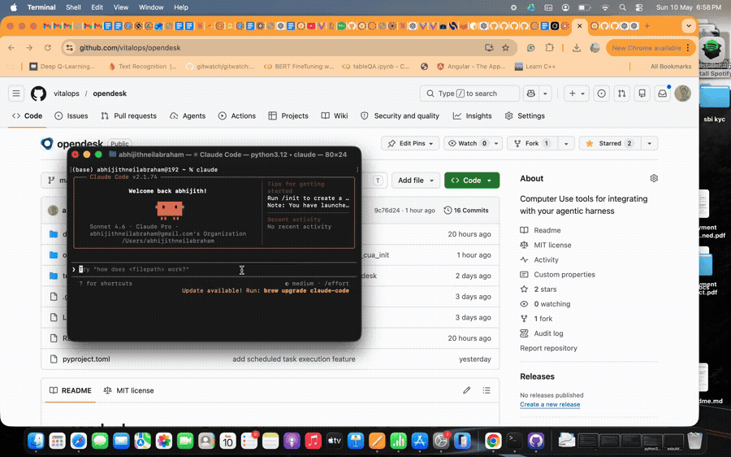

<div align="center">

# opendesk

**Give any AI agent eyes and hands on your desktop.**

Opendesk is a computer use framework that lets AI agents navigate your computer just like a human would — screenshots, mouse, keyboard, UI interaction, OCR, workflow recording, scheduling, and remote machine control.

**macOS · Linux · Windows**

[](https://pypi.org/project/opendesk/)
[](https://www.npmjs.com/package/@vitalops/opendesk-sdk)
[](LICENSE)

</div>

---



---

## SDKs

| Language | Location | Package | Install |
|----------|----------|---------|---------|
| Python | [`python/`](python/) | `opendesk` (PyPI) | `pip install 'opendesk[core,mcp]'` |
| JavaScript / TypeScript | [`js/`](js/) | `@vitalops/opendesk-sdk` (npm) | `npm install @vitalops/opendesk-sdk` |

More SDKs can be added to this repo following the same pattern.

---

## MCP install (Claude Code / Claude Desktop)

Use opendesk as an MCP server — no code needed, just install and start chatting.

### Python

```bash
pip install 'opendesk[core,mcp]'
opendesk install
```

> Requires Python 3.10+

### JavaScript / TypeScript

```bash
npm install @vitalops/opendesk-sdk
npx opendesk-js install
```

Once installed, start a Claude Code conversation and try:

```
Take a screenshot of my screen
Click the Chrome icon
Open Spotify and play lo-fi beats
```

---

## SDK usage

Use opendesk programmatically in your own agent or app.

### Python

```python
from opendesk import create_registry, allow_all_context

registry = create_registry()
ctx = allow_all_context()

result = await registry.get("screenshot").execute(ctx, ...)
```

### JavaScript / TypeScript

```typescript
import { OpenDeskClient } from "@vitalops/opendesk-sdk";

const client = new OpenDeskClient();
await client.screenshot({ marks: true });
await client.ui({ action: "click", app: "Safari", title: "Go" });
```

---

## Architecture

opendesk is built in independently-importable layers:

```
┌──────────────────────────────────────────────────────────────┐
│  Integrations   MCP  ·  Claude Code  ·  OpenAI  ·  LangChain │
├──────────────────────────────────────────────────────────────┤
│  Tools          screenshot · mouse · keyboard · ui ·         │
│                 clipboard · ocr · learn · schedule           │
├──────────────────────────────────────────────────────────────┤
│  Computer       LocalComputer  ·  RemoteComputer  (ABC)      │
├──────────────────────────────────────────────────────────────┤
│  Remote         server · client · discovery (mDNS)           │
├──────────────────────────────────────────────────────────────┤
│  Protocol       frames · codec (msgpack) · peer · transports │
│                 auth (X25519 + AEAD, pairing)                │
└──────────────────────────────────────────────────────────────┘
```

| Layer | What it does |
|-------|-------------|
| **Computer** | The capability surface of a computer (observe / act / subscribe). `LocalComputer` drives the local machine; `RemoteComputer` forwards every call over the wire to a paired peer. Tools and integrations target this ABC — they never know whether the machine is local or remote. |
| **Tools** | One class per capability, agent-friendly Pydantic schemas. Calls into the active `Computer` on the `ToolContext`. |
| **Integrations** | Thin adapters for MCP, Anthropic, OpenAI, LangChain — add one tool, get all four. |
| **Remote** | `opendesk serve` / `opendesk pair`, mDNS discovery, client helper. |
| **Protocol** | Five-frame wire protocol (msgpack binary, no base64 ever), WebSocket transport, mutual X25519 + ChaCha20-Poly1305 auth and encryption. |
| **Automation** | `learn` + `schedule` backed by pynput recording, JSON storage, APScheduler daemon. |

Full details → [docs/architecture.md](docs/architecture.md)

---

## Tools

| Tool | What it does |
|------|-------------|
| `screenshot` | Capture the screen with numbered boxes on every clickable element (Set-of-Marks) |
| `ui` | Click and type by element name — no coordinates needed |
| `mouse` | Pixel-level mouse control for anything `ui` can't reach |
| `keyboard` | Type text, press keys, send hotkeys |
| `app` | Open, close, and focus applications |
| `clipboard` | Read and write the system clipboard |
| `ocr` | Extract text from any region of the screen |
| `learn` | Record a workflow once, replay it anytime |
| `schedule` | Run any task or learned procedure on a timer |

Full reference → [docs/tools.md](docs/tools.md)

---

## Automation

Record a task once, replay it forever, or put it on a schedule.

**Record**
```
"Start recording task expense-form"
```
Perform the workflow yourself. The agent captures every click, keystroke, and screenshot.

**Replay**
```
"Stop recording"
"Replay expense-form"
```
The agent re-executes using the current screen state — no hardcoded coordinates.

**Schedule**
```
"Every morning at 9am, open my email in Chrome, take a screenshot, and summarize what's there"
"Schedule expense-form every friday at 5pm"
```
```bash
opendesk scheduler start
```

Supported timing: `every 30m` · `every 2h` · `every day at 09:00` · `every friday at 17:00` · raw cron

Full guide → [docs/automation.md](docs/automation.md)

---

## Remote computer use

Control another machine from your agent — same tools, same MCP server, the
`Computer` abstraction just lives on the other end of an encrypted WebSocket.

**On the machine being controlled** (one time):

```bash
pip install 'opendesk[core,remote]'
opendesk pair        # prints a 6-digit code, listens
```

**On the controller** (one time):

```bash
pip install 'opendesk[remote]'
opendesk discover                          # list opendesk peers on the LAN
opendesk pair-with <host> <code> --name mini
```

**After pairing**, the controlled machine runs the long-lived server:

```bash
opendesk serve            # accepts paired peers only
```

…and the controller drives it through the existing MCP server (Claude Code,
Claude Desktop, Cursor — anything that speaks MCP). The agent gets new admin
tools — `opendesk_peers`, `opendesk_use`, `opendesk_status` — and every
existing tool accepts an optional `peer:` argument:

```
screenshot                       → controls the local machine
screenshot peer=mini             → controls the paired remote
opendesk_use mini                → make mini the default for this session
screenshot                       → [on mini] ...
```

With exactly one paired peer the agent doesn't have to specify anything —
it becomes the implicit default. With multiple, the agent must pick
explicitly (no silent fallback).

**One controller at a time.** Pair as many machines as you like, but only
one drives the desktop at a time — a second peer trying to connect while
one is active gets a clean `BUSY` error. Same peer reconnecting bumps
the previous session (no waiting out a stale TCP). Two ways to free the
slot from the controlled machine:

- `opendesk disconnect` — **cooperative**. Server asks the controller to
  leave via a `session.evicted` PUSH; a cooperative client (the in-tree
  `RemoteComputer`) suppresses its auto-reconnect and raises
  `SessionEvicted`. Trust is preserved.
- `opendesk unpair <name>` — **enforced**. Revokes trust + closes the
  session; next reconnect fails authentication.

**Security model:** pairing exchanges long-lived X25519 keypairs via a 6-digit
code-authenticated handshake (PBKDF2-stretched, ~CPU-month to brute force).
Subsequent connections use mutual static-key authentication. Every frame is
ChaCha20-Poly1305 AEAD-encrypted with per-direction counters. No CA-signed
certificates required — the keys ARE the trust.

Full guide → [docs/remote.md](docs/remote.md)

---

## Installation options

```bash
pip install opendesk                              # core framework only
pip install 'opendesk[core,mcp]'                  # + screen capture + MCP server (recommended)
pip install 'opendesk[core,mcp,remote]'           # + control another machine over LAN
pip install 'opendesk[core,mcp,learn]'            # + task recording and replay
pip install 'opendesk[core,mcp,learn,schedule]'   # + scheduled tasks
pip install 'opendesk[all]'                       # everything
```

---

## Platform support

| Feature | macOS | Linux | Windows |
|---------|:-----:|:-----:|:-------:|
| Screenshot | ✓ | ✓ | ✓ |
| Mouse & keyboard | ✓ | ✓ | ✓ |
| UI element access | AppleScript | AT-SPI2 | UI Automation |
| Clipboard | pbcopy/pbpaste | xclip/xsel | pyperclip |
| OCR | Vision / tesseract | tesseract | WinRT / tesseract |
| App control | `open -a` | `xdg-open` | `start` |
| Task recording | ✓ | ✓ | ✓ |
| Scheduled tasks | ✓ | ✓ | ✓ |
| Remote control (LAN) | ✓ | ✓ | ✓ |
| LAN discovery (mDNS) | ✓ | ✓ | ✓ |

---

## System permissions

### macOS
- **System Settings → Privacy & Security → Screen Recording** — enable for your terminal
- **System Settings → Privacy & Security → Accessibility** — enable for mouse/keyboard control

### Linux
```bash
sudo apt install xclip xdotool python3-atspi
```

### Windows
No extra permissions needed — opendesk uses Win32 APIs by default.

See [docs/permissions.md](docs/permissions.md) for full setup guide.

---

## Integrations

### Claude Code
```bash
opendesk install        # registers opendesk-mcp globally
opendesk uninstall      # removes the registration
```

### Claude Desktop

Add to your config file:
- **macOS**: `~/Library/Application Support/Claude/claude_desktop_config.json`
- **Windows**: `%APPDATA%\Claude\claude_desktop_config.json`
- **Linux**: `~/.config/Claude/claude_desktop_config.json`

```json
{
  "mcpServers": {
    "opendesk": { "command": "opendesk-mcp" }
  }
}
```

### Python API

```python
import asyncio
from opendesk import create_registry, allow_all_context

async def main():
    registry = create_registry()
    ctx = allow_all_context()

    result = await registry.get("screenshot").execute(
        ctx, registry.get("screenshot").Params(marks=True)
    )
    print(result.output)

asyncio.run(main())
```

Works with Anthropic SDK, OpenAI, and LangChain — see [docs/integrations.md](docs/integrations.md)

### On-device models (Ollama, LM Studio, vLLM, llama.cpp)

Any OpenAI-compatible local server works out of the box:

```python
from openai import OpenAI
from opendesk.integrations.openai_compat import OpenAIAdapter

client = OpenAI(base_url="http://localhost:11434/v1", api_key="ollama")
adapter = OpenAIAdapter()
result = await adapter.run_loop(client, model="qwen2.5:72b", messages=messages)
```

---

## Citation

If you use opendesk in your research or project, please cite it:

```bibtex
@software{opendesk,
  author  = {Abraham, Abhigith Neil and Rahman, Fariz and Rahman, Fadil},
  title   = {opendesk: Open Desktop Automation Framework},
  year    = {2026},
  url     = {https://github.com/vitalops/opendesk},
  version = {0.2.0},
  license = {MIT}
}
```

A `CITATION.cff` is included — GitHub's "Cite this repository" button will pick it up automatically.

---

## License

MIT
