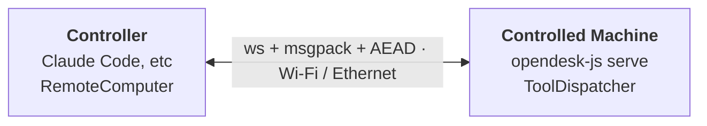

# Remote Computer Use — JavaScript / TypeScript SDK

Use an opendesk agent on one machine to control another over the LAN. Every
existing tool (`screenshot`, `mouse`, `keyboard`, `ui`, `app`, `clipboard`,
`ocr`) works the same — the `RemoteComputer` abstraction just lives on the
other end of an encrypted WebSocket.

> **Cross-SDK compatibility.** The JS and Python SDKs share the same wire
> protocol and the same `~/.opendesk/trusted-peers.json` format (snake_case
> keys). A machine paired with `opendesk pair` (Python) can be connected to
> from `connect()` (JS) and vice versa — no re-pairing needed.

## Mental model

| Term | Means |
|---|---|
| **Controlled machine** | The one being controlled. Runs `opendesk-js pair` once, then `opendesk-js serve` long-running. In protocol terms it's the **server** — it listens. |
| **Controller** | The machine running the agent (Claude Code, Claude Desktop, etc.). Runs `opendesk-js pair-with` once, then drives the controlled machine over MCP or the JS API. In protocol terms it's the **client** — it initiates. |
| **Pairing** | One-time exchange that establishes mutual trust via a 6-digit code shown on the controlled machine. After pairing both ends know each other's long-lived public keys and can reconnect without the code. |
| **Trusted-peers store** | `~/.opendesk/trusted-peers.json` on each side — the list of peers that machine has paired with. |
| **ToolDispatcher** | Server-side class that maps incoming `tool.*` RPC calls to local JS tool implementations and records each call to the audit log. |

## Guides

- [Setup](setup.md) — one-time pairing
- [Running](running.md) — `opendesk-js serve` and `opendesk-js connect`
- [MCP Integration](mcp.md) — peer resolution, admin tools, agent example
- [Audit Log](audit.md) — JSONL audit file, CLI viewer, programmatic access
- [Security](security.md) — threat model, files on disk
- [CLI Reference](cli.md)
- [Concurrency](concurrency.md) — single-controller policy, disconnect vs unpair
- [Programmatic Use](programmatic.md) — connect, pair, serve from Node.js
- [Troubleshooting](troubleshooting.md)
