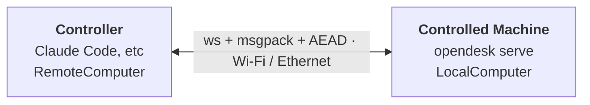

# Remote Computer Use — Python / CLI

Use an opendesk agent on one machine to control another over the LAN. Every
existing tool (screenshot, mouse, keyboard, ui, app, clipboard, ocr) works
the same — the `Computer` abstraction just lives on the other end of an
encrypted WebSocket.

## Mental model

| Term | Means |
|---|---|
| **Controlled machine** | The one being controlled. Runs `opendesk pair` once, then `opendesk serve` long-running. In protocol terms it's the **server** — it listens. |
| **Controller** | The machine running the agent (Claude Code, Claude Desktop, etc.). Runs `opendesk pair-with` once, then talks to the controlled machine over MCP / the Python API. In protocol terms it's the **client** — it initiates. |
| **Pairing** | One-time exchange that establishes mutual trust via a 6-digit code shown on the controlled machine. After pairing, both ends know each other's long-lived public keys and can reconnect without the code. |
| **Trusted-peers store** | `~/.opendesk/trusted-peers.json` on each side — the list of peers that machine has paired with. |

## Guides

- [Setup](setup.md) — one-time pairing
- [Running](running.md) — `opendesk serve` and `opendesk connect`
- [MCP Integration](mcp.md) — peer resolution, admin tools, agent example
- [Security](security.md) — threat model, files on disk
- [CLI Reference](cli.md)
- [Service Install](service.md) — survive reboots
- [Concurrency](concurrency.md) — single-controller policy, disconnect vs unpair
- [Programmatic Use](programmatic.md) — Python and JS APIs
- [Troubleshooting](troubleshooting.md)
